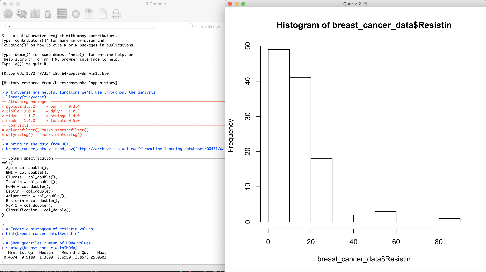
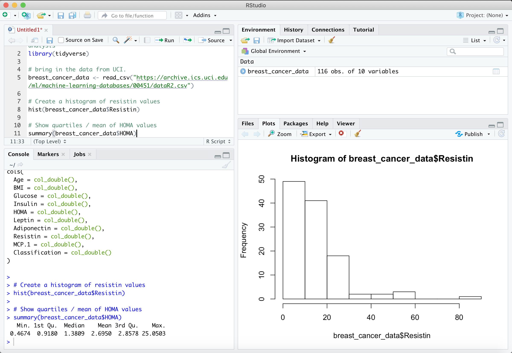

# Intro to R and RStudio
## Expanding Your Toolset

## Overview

This module provides learners with an approachable introduction to the R language and the RStudio IDE.

**Estimated time to completion**: 1 hour

**Pre-requisites**: It is helpful if learners have used data in a tabular (table-shaped) format, with rows and columns.  Examples of this kind of data include comma separated values files (.csv) and spreadsheets (for example, Microsoft Excel).  Learners do *not* need to have access to R or RStudio on their own computers.

**Learning Objectives**:  After completion of this module, learners will be able to:

* Describe what R is and what RStudio is
* Explain why using R and RStudio can improve research

## Content

### What is R?

R is a statistical programming language.  As a programming language, R requires that you write code that instructs a computer in what to do.  It's not point-and-click software like Excel or SPSS.

R code looks something like this:

```
library(tidyverse)
breast_cancer_data <- read_csv("https://archive.ics.uci.edu/ml/machine-learning-databases/00451/dataR2.csv")
hist(breast_cancer_data$Resistin)
summary(breast_cancer_data$HOMA)
```

Ideally, R code includes helpful hints along the way to help future data users understand what's happening.

For example, the following may be a bit easier to understand, even if you are brand new to R:

```
# tidyverse has helpful functions we'll use throughout the analysis
library(tidyverse)

# bring in the data from UCI.
breast_cancer_data <- read_csv("https://archive.ics.uci.edu/ml/machine-learning-databases/00451/dataR2.csv")

# Create a histogram of resistin values
hist(breast_cancer_data$Resistin)

# Show quartiles / mean of HOMA values
summary(breast_cancer_data$HOMA)
```

You can write R code and execute it in many ways, including using the command line, the R console, and in a Jupyter notebook.  Here, however, we're going to concentrate on using RStudio.

### What is RStudio?

RStudio is an IDE, or Integrated Development Environment, which pulls together (integrates) useful tools like help files, image viewers,  data previews, and version control for people writing (developing) code, and it puts all these tools together in a visually pleasing and helpful environment.  It's an add-on tool that makes working with R easier because it gives extra help and context.

For example, I could include the code mentioned above in a simple R console, which is what you get when you install R by itself.



Above, you can see that the R console had to open a new program (in my Mac, it's the Quartz viewer) to display the histogram.  But you can't tell anything else about the breast_cancer_data datset.  What other variables are there?  How many rows in the data?  How can I get more information on how to use the `hist` command?  Using the R.app or R console tool is very bare bones.

On the other hand, you could run the same code in RStudio and see something like this:



Here, you can save your code for reuse later (it's currently "Untitled" and unsaved), get a sneak peek at the data (116 rows of 10 columns), see the plot in the same window as everything else, and also have many other helpful tools, like a file browser, help tab, history of commands you've run recently, and more.  RStudio is the preferred method for most uses of R, and it's generally what we use to teach.
